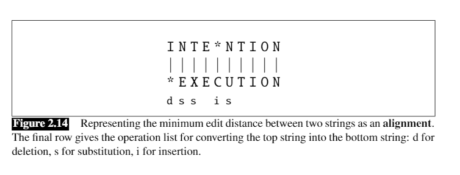

# Regular Expressions, Text Normalization, Edit Distance (2)
In these notes, some sections will be ignored in the event of lack of personal relevance. 
## Table of Contents
- [Regular Expressions, Text Normalization, Edit Distance (2)](#regular-expressions-text-normalization-edit-distance-2)
  - [Table of Contents](#table-of-contents)
  - [Regex in Python](#regex-in-python)
  - [Regular Expressions (2.1)](#regular-expressions-21)
    - [Basic Regular Expression Patterns (2.1.1)](#basic-regular-expression-patterns-211)
    - [Disjuction, Grouping, and Precedence (2.1.2)](#disjuction-grouping-and-precedence-212)
    - [More operators (2.1.4)](#more-operators-214)
    - [Substitution, Capture Groups (2.1.6)](#substitution-capture-groups-216)
  - [Words (2.2)](#words-22)
    - [Key Definitions](#key-definitions)
  - [Corpora (2.3)](#corpora-23)
  - [Text Normalization (2.4)](#text-normalization-24)
  - [Minimum Edit Distance (2.5)](#minimum-edit-distance-25)

---
## Regex in Python

```python
import re

text = "This is a lot of stuff"
match = re.search(r"lot", text)
x = re.findall(r"[Tt]", text)

# also consider re.sub()

```
In regard to the match object:

`.span()` returns a tuple containing the start-, and end positions of the match.

`.string` returns the string passed into the function

`.group()` returns the part of the string where there was a match

---
## Regular Expressions (2.1)

Regular expressions are for specifying text search strings. They can be used when there is a pattern to search for. They can be used in conjuction with `grep` and other tools like Python. 


### Basic Regular Expression Patterns (2.1.1)
| RE | Explanation |
| --- | --- | 
|[wW]oodchucks | [] Match either character in the spot |
|[A-Z] | an upper case letter | 
|[a-z] | a lowercase letter |
|[0-9] | any digit |
|^[A-Z] | ^ is the `not` operator, not any uppercase letter |
|woodchucks? | ? makes the preceding character optional -> zero or one instances of the previous character | 
| a* | The * (Kleene *) operator matches 0 or more of the preceding character |
| aa* | Matches case with one or more "a" |
| [0-9]+ | The Kleene + operator means one or more occurences of the preceding character or regular expression. This specifically means a sequence of digits.
|beg.n|The period is a wildcard expression that matches any single character. In this case, it matches for words like "begun", "began", and "beg3n" |
| ^ | start of line |
| \$ | end of line |
| \b | word boundary; `\bthe\b` isolates the word "the" but not in "other" |
| \B | non-word boundary; opposite of `\b` |


### Disjuction, Grouping, and Precedence (2.1.2)
The disjunction operator allows one to match for either of one of multiple strings. This is the pipe `|` symbol.  `cat|dog` matches either cat or dog. The `()` operators make a pattern act as a single character. `gupp(y|ies)` matches both the singular or plural option.

---
### More operators (2.1.4)

| RE | Explanation |
| --- | --- | 
| \d | any digit |
| \D | any non-digit |
| \w | any alphanumeric/underscore |
| \W | a non-alphanumeric |
| \s | whitespace |
| \S | non-whitespace | 
| {n} | n occurences of the previous char or expression | 
| {n, m} | from n to m occurences of the previous char or expression | 
| {n,} | at least n occurences of the previous char or expression | 
| {,m} | up to m occurences of the previous char or expression | 

---
### Substitution, Capture Groups (2.1.6)
Capture groups are created via parentheses. If grouping is needed but the pattern is not wanted, place `?:` after the open paren to create a non-capturing group

## Words (2.2)

### Key Definitions

- **Corpus:** A computer-readable collection of text or speech
- **Utterance:** The spoken correlate of a sentence
  - I do uh main-mainly business data processsing
  - The utterance has two kinds of **disfluencies**, being the **fragment** of "main-" and the filler of "uh"
- **Lemma:** A set of lexical forms having the same stem, the same major part-of-speech, and word sense. 
- **Word-form:** The full inflected or derived form of the word

--- 
Looking at words, there are **types**, which are the number of distinct words in a corpus. If the set of words in the vocabulary is `V`, the number of types is the vocabulary size `|V|`. Tokens are the total number of `N` words.

The larger the corpora examined, the more word types there are found. The relationship between types `|V|` and number of tokens `N` is called Herdan's or Heap's Law. *k* and *$\beta$* are positive constants, with 0<*$\beta$*<1. $\beta$ tends to range from 0.67 to 0.75. 

$$
|V| = kN^\beta
$$

## Corpora (2.3)

An issue found in NLP algorithms recently is a lack of non-English development and testing. Some algorithms only work for English and are less relevant for others, which can create a power imbalance of sorts amongst languages. 

To better document a corpus and to ensure its use is relevant, it can be valuable for the corpus creator to create a datasheet outlining information regarding the datset such as motivation, demographics, and other stats. 

## Text Normalization (2.4)

Text normalization involves three common steps
- Tokenizing words
- Normalizing word formats
- Segmenting sentences


Tokenizing words involves segmenting text into the words. In python, `nltk` has a good library for this task. Word tokenization can also involve expanding contractions.

> As a general note, NLP algorithms learn facts about language from one corpus (a training corpus) to make decisions about a separate (test) corpus. 

To deal with inconsistencies as a result of subwords, additional morphemes, or other factors, standardization is important in text. `Byte-pair encoding` can learn frequent pairs with additional morphemes and the system can learn to account for words such as *newer* being present on the test corpus but only *new* on the training corpus. 

**Word normalization** is the task of putting words/tokens in a standard format, like choosing a single form of a word or accounting for regional variants. **Case folding** matches the case to lower for example, generalizing capitalized and uncapitalized words. 

**Lemmatization** is used to find and match words with the same roots, which can be used to simplify processing. Challenges in this process include accounting for **affixes** or additional meanings of words. 

---

## Minimum Edit Distance (2.5)

A large part of NLP involves determining how similar two strings are. This could be in regard to finding synonyms or spellchecking for example.  **Coreference** is the task of deciding whether two strings refer to the same entity. 

```
Stanford President Marc Tessier-Lavigne
Stanford University President Marc Tessier-Lavigne
```

The strings above only differ by one word whichc ould be a piece of evidence for identifying coreference. **Edit distance** is a way to quantify this intuition. **Minimum edit distance** is defined as the minimum number of editing operations needed to transform one string into another. 



A weight or cost can be assigned to each of these operations, known as the Levenshtein distance. The distance between "intention" and "execution" is 5 as shown by the image above. This minimum edit distance can be computed using dynamic programming.